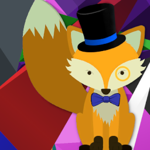

# Right Proper Lighting Engine 

The first right proper RGB lighting implementation in Minecraft.

[Join us on Discord](https://discord.gg/h7XAeCSfbT)

## Dependencies

- [LUMINA 1.0.0-rc10](https://github.com/GTMEGA/LUMINA)
- [FalseTweaks 3.0.0+](https://github.com/FalsePattern/FalseTweaks)
- [FalsePatternLib 1.2.0+](https://github.com/FalsePattern/FalsePatternLib)
- [UniMixins 0.1.17+](https://github.com/LegacyModdingMC/UniMixins)

## Authors:

- [FalsePattern](https://github.com/FalsePattern)
- [Ven](https://github.com/basdxz)

## Early Testers

- [Houston](https://github.com/Houstonruss)
  - Most meticulous tester of every small little change in a production environment.
- [Roadhog360](https://github.com/Roadhog360)
  - Actually gotated, having tested endless broken releases with his own mods.
- [matt-159](https://github.com/matt-159)
- [SirFell](https://github.com/SirFell)
- [jss2a98aj](https://github.com/jss2a98aj)
- [mist475](https://github.com/mist475)
